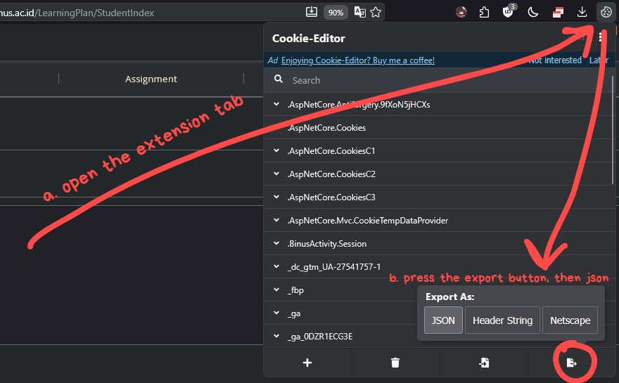

# Djie's Binus Logbook Importer
This Python script automates the process of uploading monthly activity entries from an Excel file (`monthly_activity.xlsx`) to the Binus Activity Enrichment logbook system. It uses HTTP requests to interact with the API, authenticating via cookies exported from your browser session.
The script fetches available months, loads data from the Excel sheet, processes each row (date, activity, description, clock-in/out times), checks if an entry exists for each date, and either creates a new entry or updates an existing one.
## Prerequisites
- Python 3.x installed.
- Access to the Binus Activity Enrichment website (https://activity-enrichment.apps.binus.ac.id).
- An Excel file named `monthly_activity.xlsx` with the correct format (see "Preparing the Excel File" below).
- Browser cookies exported as `cookies.json` (see "Exporting Cookies" below).
## Installation
1. Clone or download this repository/script to your local machine.

2. Create a virtual environment (optional but recommended to isolate dependencies):

   ```
   python -m venv venv
   ```

   Activate the virtual environment:
   - On Windows:
     ```
     venv\Scripts\activate
     ```
   - On Unix/macOS:
     ```
     source venv/bin/activate
     ```

3. Install the required Python packages using `pip`:

   ```
   pip install -r requirements.txt
   ```
## Usage
1. Prepare your `cookies.json` file (see below).
2. Prepare your `monthly_activity.xlsx` file (see below).
3. Run the script:
   ```
   python main.py
   ```
   - The script will print progress, including API statuses, processed dates, and save responses.
   - It handles both creating new entries and updating existing ones.
   - If a date is in the future (e.g., after the current date), it may not be visible on the website yet, but the entry should still be saved.
## Preparing the Excel File (`monthly_activity.xlsx`)
- The file should have a sheet named `Sheet1`.
- Column structure (starting from row 1 as headers, data from row 2):
  - Column A: Date (as Excel date serial or datetime, e.g., formulas that compute dates for the month).
  - Column B: Activity (text, or 'OFF' for off days).
  - Column C: Description (text, or 'OFF' for off days).
  - Column D: Clock In (decimal time like 0.375 for 9:00 AM, or time object, or 'OFF').
  - Column E: Clock Out (decimal time like 0.75 for 6:00 PM, or time object, or 'OFF').
- Example rows (after computation with `data_only=True`):
  - Dates should resolve to valid datetime objects (e.g., 2025-12-01).
  - For off days, use 'OFF' in clock columns to skip times, and optionally in activity/description.
- Tip: Use Excel formulas for sequential dates, e.g., starting with `=DATE(2025,12,1)` and dragging down.


# DISCLAIMER!! THIS SCRIPT DOES NOT STORE ANY COOKIES OR WHATSOEVER, PLEASE SECURE YOUR COOKIES SECURELY!!!! DO NOT TRUST ANYONE WHO ASKS FOR YOUR COOKIES!!!


## Exporting Cookies (`cookies.json`)
To authenticate requests, export your browser cookies from the Binus website after logging in.
1. Install the Cookie Editor extension:
   - For Chrome: [Cookie Editor](https://chromewebstore.google.com/detail/cookie-editor/hlkenndednhfkekhgcdicdfddnkalmdm?hl=en)
   - For Firefox: [Cookie Editor](https://addons.mozilla.org/en-US/firefox/addon/cookie-editor/)
2. Log in to https://activity-enrichment.apps.binus.ac.id/LearningPlan/StudentIndex# **(before that, login to https://enrichment.apps.binus.ac.id/ , select your Running period, and then go to activity enrichment apps)**
3. Open the Cookie Editor:
   - Click the extension icon.
   - Navigate to the exported cookies tab (or equivalent).

4. Export the cookies as JSON and save/paste them into a file named `cookies.json` in the same directory as the script.
   - The file should be a JSON array of cookie objects, e.g.:
     ```
     [
       {"name": "cookie_name1", "value": "value1", ...},
       ...
     ]
     ```
---
## Troubleshooting
- **Invalid Serial/Date Errors**: Ensure dates in Excel are valid and computed correctly. Open and save the file in Excel to cache formula values.
- **API Errors**: Check console output for status codes. 200 with "Successfully added/updated" means success. "Unknown Error" may indicate invalid data (e.g., empty times on non-off days).
- **Future Dates**: Entries for dates after today (e.g., post-Dec 10, 2025) may save but not display on the site until the date arrives.
- **Session Expiration**: If cookies expire, re-export them after re-logging in.
- **Dependencies**: Ensure `requests` and `openpyxl` are installed.